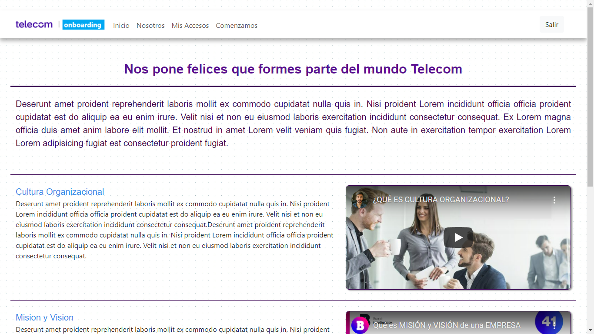

## Frontend Onboarding Equipos 
### Equipo 7 

#### Dev Team :

| Nombre | GitHub ID | Skills |
| ---- | --------- | --------- |
| Florencia Villafañe | florvillafane | Frontend |
| Jonathan Stampella | jonathan | Frontend |
| Carlos Tejada | ctejada | Frontend | 
| Ariel Lorenzo | borboton | Frontend |
| Raúl Tedesco | raultedesco | Backend |
| Daniel Torres | torresjdaniel | Backend |
| Sergio Villavicencio | svillavicencio | Backend |

#### Mentores :
| Nombre | Rol |
| ---- | --------- |
| Alex Villecco | Mentor |
| Damian Bento | Mentor |

## Screenshots

## Comenzando 🚀

_Lorem ipsum dolor sit amet. Sit dolor quia qui dicta accusantium non modi voluptas est doloremque incidunt sed dolores numquam._

Mira **Deployment** para conocer como desplegar el proyecto.

## Despliegue 📦

Deploy automatico a partir de una rama (main) en Vercel.

## Construido con 🛠️

